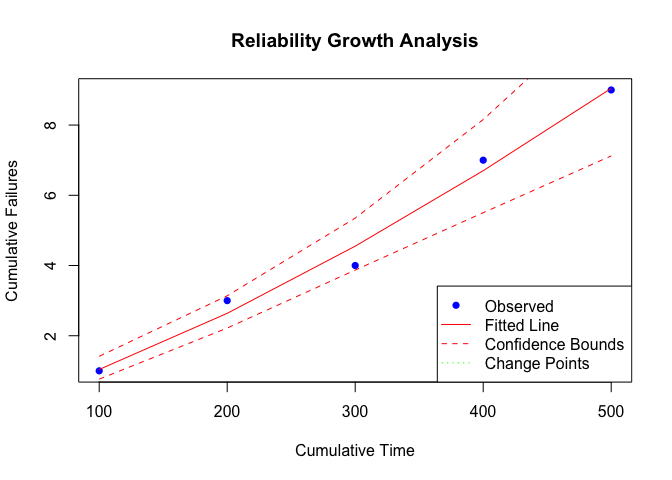

<!-- README.md is generated from README.Rmd. Please edit that file -->

# ReliaGrowR <a href="https://paulgovan.github.io/ReliaGrowR/"></a>

<!-- badges: start -->

[](https://www.repostatus.org/#active)
[](https://CRAN.R-project.org/package=ReliaGrowR)
[](https://github.com/paulgovan/ReliaGrowR/actions/workflows/R-CMD-check.yaml)
[](https://app.codecov.io/gh/paulgovan/ReliaGrowR)
[](https://cran.r-project.org/package=ReliaGrowR)
[](https://cran.r-project.org/package=ReliaGrowR)
[](https://doi.org/10.32614/CRAN.package.ReliaGrowR)
<!-- badges: end -->

## Introduction

Welcome to **ReliaGrowR**! This package provides modeling and plotting
functions for Reliability Growth Analysis (RGA) and Repairable Systems
Modeling, including:

**Reliability Growth Analysis**

- Duane Analysis
- Crow-AMSAA
- Piecewise NHPP
- Piecewise NHPP with Change Point Detection
- Forecasting (Duane and Crow-AMSAA)
- Goodness-of-Fit Testing (Cramér-von Mises, K-S)
- Reliability Demonstration Test (RDT) Planning

**Repairable Systems Modeling**

- Mean Cumulative Function (MCF)
- Power Law NHPP
- Log-Linear NHPP
- Forecasting

**AI Integration**

- MCP tools for AI assistants via `rga_mcp_server()`

RGA is focused on improving reliability during development and testing
of products, while repairable systems modeling tracks recurrence
patterns for fielded systems that can be repaired and returned to
service. By analyzing failure data, both approaches help engineers and
researchers identify trends, estimate reliability parameters, and
support decision-making over time.

To learn more about RGA, please view the [RGA
vignette](https://paulgovan.github.io/ReliaGrowR/articles/RGA.html). For
repairable systems modeling, see the [RSA
vignette](https://paulgovan.github.io/ReliaGrowR/articles/RSA.html). For
test planning, see the [RDT
vignette](https://paulgovan.github.io/ReliaGrowR/articles/RDT.html). For
AI integration, see the [MCP
vignette](https://paulgovan.github.io/ReliaGrowR/articles/MCP.html).

## Installation

To install the release version of ReliaGrowR, use:

``` r
install_packages('ReliaGrowR')
```

You can install the development version of ReliaGrowR like so:

``` r
devtools::install_github('paulgovan/ReliaGrowR')
```

## Example

Here is a basic example of Reliability Growth Analysis. First, load the
package.

``` r
library(ReliaGrowR)
```

Next, suppose a machine has failed at the following times with the
corresponding number of failures.

``` r
times <- c(100, 200, 300, 400, 500)
failures <- c(1, 2, 1, 3, 2)
```

To perform RGA, use the `rga` function and plot the results. The plot
displays the cumulative failures over time along with the fitted
reliability growth model.

``` r
result <- rga(times, failures)
plot(result, main = "Reliability Growth Analysis", xlab = "Cumulative Time", ylab = "Cumulative Failures")
```



## AI Integration via MCP

ReliaGrowR can expose its analysis functions as [Model Context Protocol
(MCP)](https://posit-dev.github.io/mcptools/) tools so AI assistants
like Claude can call them directly. First install the required packages:

``` r
install.packages(c("mcptools", "ellmer"))
```

Then add the server to Claude Code:

``` bash
claude mcp add -s user reliagrowR -- Rscript -e "ReliaGrowR::rga_mcp_server()"
```

Once configured, you can ask Claude to fit models, run forecasts, plan
demonstration tests, and more — all without writing any R code yourself.
See the [MCP
vignette](https://paulgovan.github.io/ReliaGrowR/articles/MCP.html) for
full setup instructions.

## Code of Conduct

Please note that the ReliaGrowR project is released with a [Contributor
Code of
Conduct](https://contributor-covenant.org/version/2/1/CODE_OF_CONDUCT.html).
By contributing to this project, you agree to abide by its terms.
