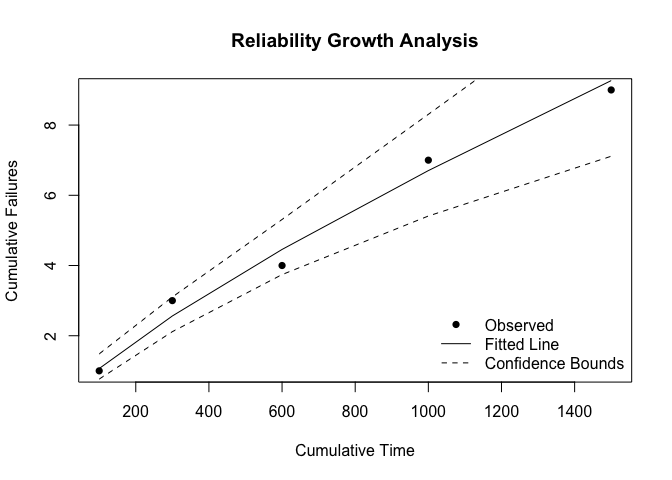

<!-- README.md is generated from README.Rmd. Please edit that file -->

# RGA

## Reliability Growth Analysis via:

- Crow-AMSAA
- Piecewise Weibull NHPP
- Piecewise Weibull NHPP with change point detection

## Installation

You can install the development version of RGA like so:

``` r
devtools::install_github('paulgovan/RGA')
```

## Example

Here is a basic example of Reliability Growth Analysis:

First, load the package:

``` r
library(RGA)
```

Next, set up some cumulative time and failure data:

``` r
times <- c(100, 200, 300, 400, 500)
failures <- c(1, 2, 1, 3, 2)
```

Then run the RGA and plot the results:

``` r
result <- rga(times, failures)
plot_rga(times, failures, result)
```


